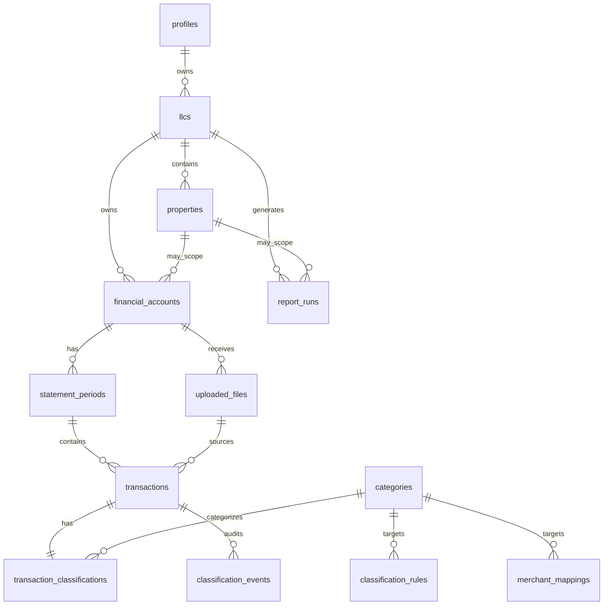
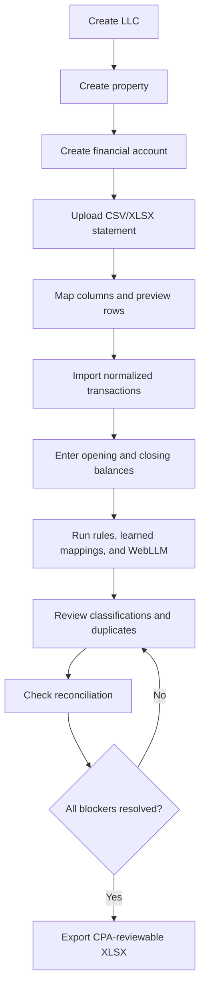

# AI Financial Statement Generator for Real Estate LLCs - Product Design

Date: 2026-07-13
Status: Approved for implementation planning
Workspace: AI Financials for CPA Web

## 1. Goal

Build a SaaS MVP that helps Valoris prepare annual CPA packages for real estate LLCs. The product turns bank and credit-card statement activity into practical, CPA-reviewable financial reports, tracks the documents required by the annual CPA/K-1 process, and produces a clean workbook plus CPA memo. The product only uses uploaded statement data, normalized transactions, user-entered statement balances, deterministic rules, local browser AI classification, and user corrections.

The MVP must not assume QuickBooks, accounting journals, prior books, accrual records, depreciation, property value, accounts receivable, accounts payable, historical equity adjustments, or invented entries.

The product's core promise is:

> Create the annual CPA package, collect support, upload statement data, review classifications, reconcile the period, then export a CPA-reviewable workbook and CPA memo.

## 2. MVP Scope

The primary MVP user is the owner/operator of one or more real estate LLCs. CPA collaboration is deferred; the CPA receives the exported workbook.

Included in MVP:

- LLC creation and management.
- Property creation under an LLC.
- Financial account creation under an LLC, with each account bound to one property or to the LLC as a whole.
- Annual CPA package workspace per LLC and tax year.
- CPA package checklist for entity documents, prior-year returns, K-1s received, monthly bank statements, IRS/state notices, financial statements, other support, and CPA memo.
- CSV and XLSX statement uploads.
- Column mapping for files from different banks.
- Server-side parsing and normalization into a standard transaction schema.
- Storage of original uploaded files and normalized records in Supabase.
- Local browser AI classification through WebLLM when available.
- Deterministic classification fallback through rules, merchant mappings, and manual review.
- User correction learning at LLC and property scope.
- Transaction review, bulk classification, and audit history.
- Manual entry of opening and closing statement balances per account period.
- Reconciliation gate using statement balances and imported movements.
- Review status tracking for support gaps and CPA review items.
- Draft previews for reports.
- Final XLSX export only when all in-scope transactions are classified and account periods are reconciled.
- CPA memo generation with missing documents and open review items.
- P&L, Balance Sheet, and Transaction Detail workbook following the Valoris CPA package standard.

Deferred from MVP:

- PDF extraction and OCR.
- Per-transaction property splitting.
- Multi-user CPA workspace, comments, approvals, and role-based collaboration.
- Google Drive folder automation.
- Direct bank connections.
- QuickBooks or accounting-system integrations.
- Full GAAP balance sheet.
- Depreciation, fixed-asset register, AP, AR, accruals, security deposit liabilities, and historical equity adjustments unless future uploaded evidence supports them.
- Multi-currency and non-US jurisdiction support.

## 3. Product Boundaries and Accounting Position

The reports are cash-basis activity reports generated from transaction movements and statement balances. The UI and CPA memo must clearly state that they are not a full accounting ledger and not a substitute for CPA review.

Tax-specific boundary:

- The system must not calculate partner tax basis, tax capital, at-risk basis, or final K-1 allocations.
- K-1 income/loss from other entities is always `CPA Review` unless explicitly supported by CPA-provided schedules in future scope.
- Missing support is listed in the CPA memo instead of guessed.

P&L:

- Revenue includes Rental Income, Late Fees, and Other Income.
- Operating expenses include standard real estate expense categories.
- Capital Improvements are tracked separately from operating expenses so the user and CPA can decide final treatment.
- Interest Expense is shown separately below Net Operating Income.
- The report supports monthly, quarterly, annual, and year-to-date periods.

Simplified balance/position report:

- Cash comes from user-entered bank opening/closing balances and reconciled account movement.
- Credit card liabilities and loan liabilities come from user-entered account statement balances when those account types are present.
- Owner Contributions and Owner Distributions come only from classified transactions.
- Retained earnings must not be invented as a plug. If the report cannot fully support equity from uploaded evidence, it shows an explicit "unclassified/unsupported equity position" or disclosure instead of fabricating accounting history.
- The report excludes property value, depreciation, fixed assets, AR, AP, accruals, security deposit liabilities, and historical equity adjustments unless explicitly supported by future product scope.

## 4. Recommended Approach

Use the transaction-ledger SaaS approach:

- Supabase stores users, LLCs, properties, accounts, uploaded file metadata, normalized transactions, statement periods, balances, rules, merchant mappings, classifications, and audit history.
- Supabase Storage stores original uploads.
- Next.js provides the owner/operator app, upload flow, transaction review, report preview, and XLSX export.
- WebLLM runs only in the browser, preferably in a Web Worker, and returns classification suggestions. No external AI APIs are used.
- Server-side logic handles deterministic parsing, normalization, persistence, reconciliation checks, and report generation.

This approach gives the MVP a durable audit trail and multi-device SaaS behavior while keeping AI inference local and optional.

Rejected alternatives:

- Fully local-only app: better privacy, but weaker SaaS account continuity, storage, and audit workflow.
- Full accounting engine: too large for MVP and conflicts with the rule that the app must not invent missing ledger history.

## 5. Architecture

Frontend:

- Next.js App Router with TypeScript.
- Tailwind and shadcn/ui for a restrained operational SaaS interface.
- Client-side WebLLM worker for AI suggestions.
- Upload wizard, transaction review tables, reconciliation screens, report previews, and export controls.

Backend:

- Next.js server actions or API routes for authenticated operations.
- Supabase Auth for authentication.
- Supabase PostgreSQL for structured data.
- Supabase Storage for original files.
- XLSX generation on the server for deterministic workbook output.

Local AI:

- WebLLM runs in the browser.
- Candidate models can include Llama 3.x, Qwen, Phi, or another browser-compatible local model.
- If the browser cannot support the model or the user declines model loading, the product continues with rules, merchant mappings, and manual review.

Data and reporting:

- Reports are generated from normalized transactions, classification state, statement-period balances, and reconciliation status.
- Final exports are gated by completeness and reconciliation, not by AI confidence alone.

## 6. Core Data Model

Primary entities:

- `profiles`: user profile linked to Supabase Auth.
- `llcs`: owner-scoped legal entities.
- `properties`: properties under an LLC.
- `financial_accounts`: bank, credit card, loan, security deposit, or other accounts under an LLC. Each account may be bound to one property or left LLC-wide.
- `uploaded_files`: original file metadata, storage path, upload status, parse status, and parser diagnostics.
- `statement_periods`: account period, start date, end date, opening balance, closing balance, and reconciliation status.
- `transactions`: normalized movement records with raw source values and normalized fields.
- `categories`: standardized real estate chart of accounts.
- `classification_rules`: user-defined rules scoped to LLC or property.
- `merchant_mappings`: learned merchant/category mappings from corrections.
- `transaction_classifications`: current category, source, confidence score, review state, and user override flag.
- `classification_events`: append-only history of AI suggestions, rule matches, manual edits, and bulk updates.
- `report_runs`: generated previews/exports, period, scope, status, disclosures, and workbook metadata.

Standard chart of accounts:

- Income: Rental Income, Late Fees, Other Income.
- Operating expenses: Property Management, Repairs & Maintenance, Utilities, Insurance, Property Taxes, Legal, Marketing, Payroll, Bank Fees, Other Expense.
- Separate CPA-review line: Capital Improvements.
- Financing: Interest Expense.
- Balance/position categories: Cash, Credit Card Liability, Loan Liability, Owner Contributions, Owner Distributions, Unsupported Equity Position disclosure.

Transaction fields:

- Date.
- Raw description.
- Normalized merchant.
- Amount, with one signed normalized value.
- Debit/credit original fields when present.
- Source account.
- Source file and row/sheet reference.
- Statement period.
- Duplicate fingerprint.
- Classification status.
- Property/LLC scope inherited from account.

Minimum database schema:

```text
profiles(id, auth_user_id, full_name, created_at)
llcs(id, owner_id, legal_name, tax_year_start_month, created_at, updated_at)
properties(id, llc_id, name, address_line1, city, state, postal_code, created_at, updated_at)
financial_accounts(id, llc_id, property_id, name, account_type, institution_name, last4, created_at, updated_at)
uploaded_files(id, owner_id, llc_id, account_id, statement_period_id, storage_path, original_name, file_type, parse_status, diagnostics_json, created_at)
statement_periods(id, account_id, period_start, period_end, opening_balance, closing_balance, movement_total, variance, reconciliation_status, created_at, updated_at)
transactions(id, owner_id, llc_id, property_id, account_id, statement_period_id, uploaded_file_id, source_row_ref, transaction_date, raw_description, normalized_merchant, amount, original_debit, original_credit, duplicate_fingerprint, import_status, created_at)
categories(id, code, name, report_section, is_system, is_active)
classification_rules(id, owner_id, llc_id, property_id, match_type, pattern, category_id, priority, is_active, created_at, updated_at)
merchant_mappings(id, owner_id, llc_id, property_id, normalized_merchant, category_id, source, is_active, created_at, updated_at)
transaction_classifications(id, transaction_id, category_id, source, model_score, review_state, user_override, created_at, updated_at)
classification_events(id, transaction_id, previous_category_id, new_category_id, source, actor_user_id, note, created_at)
report_runs(id, owner_id, llc_id, property_id, period_start, period_end, status, disclosures_json, workbook_storage_path, created_at)
```

ERD:



## 7. Input and Normalization Flow

1. User selects LLC, account, and period.
2. User uploads CSV or XLSX.
3. Original file is stored in Supabase Storage.
4. Parser reads rows and proposes column mappings for date, description, amount, debit, credit, and balance if present.
5. User confirms mappings when automatic detection is not confident.
6. Server normalizes rows into transactions.
7. System computes duplicate fingerprints from account, date, amount, description, and source metadata.
8. System assigns imported rows to a statement period.
9. User enters or confirms opening and closing balances for the statement period.
10. System calculates reconciliation status:

```text
opening balance + normalized period movement = expected closing balance
```

11. If expected and entered closing balances do not match within the configured tolerance, the period stays unreconciled and final export is blocked.

User flow:



## 8. Classification Flow

Classification priority:

1. Property-scoped user rule.
2. LLC-scoped user rule.
3. Property-scoped merchant mapping learned from a user correction.
4. LLC-scoped merchant mapping learned from a user correction.
5. Built-in merchant mapping.
6. WebLLM suggestion.
7. Manual review.

Every classification stores:

- Category.
- Source: rule, learned mapping, built-in mapping, WebLLM, manual, or bulk manual.
- Confidence or score when applicable.
- Whether the user overrode it.
- Timestamp and actor.
- Previous value in classification history.

Learning behavior:

- When a user changes a transaction category, the app offers to remember the merchant/category mapping at property or LLC scope.
- Future matching transactions use the learned mapping before AI inference.
- The user can edit or disable learned mappings.

AI behavior:

- WebLLM receives normalized merchant, raw description, amount sign, account type, and candidate categories.
- The model returns a category and confidence-like score.
- The UI labels the score as model confidence, not as accounting certainty.
- AI suggestions are never treated as CPA approval.

## 9. Reporting and Export

Report scopes:

- LLC-wide.
- Single property.
- Date period: monthly, quarterly, annual, and year-to-date.

Draft preview:

- Always available after transactions exist.
- Shows missing classifications, unreconciled periods, duplicate warnings, and disclosure notices.

Final export gate:

- All in-scope transactions must have a category.
- All in-scope statement periods must be reconciled.
- Duplicate conflicts must be resolved or explicitly excluded.
- Report disclosures must be included.

Final workbook standard:

- The final CPA workbook has exactly three visible tabs: `Transaction Detail`, `P&L <year>`, and `Balance Sheet`.
- P&L and Balance Sheet values are formulas from `Transaction Detail`.
- P&L and Balance Sheet use the sober Valoris standard: no colors, no notes, no borders, and no gridlines.
- `Balance Check` must be zero or the unresolved delta must be explained in the CPA memo.
- Internal reconciliation, source-file, disclosure, and classification-summary screens may exist in the app, but they are not visible workbook tabs in the final CPA package export.

## 10. User Experience

Primary navigation:

- Dashboard.
- LLCs.
- Properties.
- Accounts.
- Uploads.
- Transactions.
- Reports.
- CPA Packages.
- Settings.

Key screens:

- Dashboard: total revenue, operating expenses, NOI, net income, cash position, unreconciled periods, and review queue.
- LLC management: create/edit LLCs and see related properties/accounts.
- Property management: create/edit property records under an LLC.
- Account setup: account type, name, account binding to property or LLC, and balance behavior.
- Upload wizard: choose account/period, upload CSV/XLSX, map columns, preview rows, confirm import.
- Transaction review: filters by LLC, property, account, period, category, source, confidence, and review state.
- Classification review: AI/rule/manual source visibility, bulk actions, learned mapping controls.
- Reconciliation: opening balance, movement, expected closing, entered closing, variance, and blocking issues.
- Reports: draft preview, blocking checklist, final export button, prior report runs.
- CPA Package: annual checklist, missing documents, open review items, workbook status, CPA memo status, reviewer approval status, and February 15 target.

The interface should feel like an operational finance tool: dense, calm, scannable, and optimized for repeated review work.

Wireframe descriptions:

- Dashboard: top metric strip, blocker queue, recent imports, and report shortcuts.
- LLCs: table of LLCs with property/account counts and last report date.
- Property detail: property profile, linked accounts, current-period financial summary, and transaction shortcut.
- Account detail: account metadata, statement periods, balance history, imports, and reconciliation status.
- Upload wizard: three-step flow with account/period selection, file upload, column mapping, row preview, and import confirmation.
- Transactions: spreadsheet-like table with filters, source chips, category selector, confidence/source indicators, and bulk edit toolbar.
- Classification rules: editable list of learned merchant mappings and custom rules with scope badges.
- Reconciliation: side-by-side account periods showing opening balance, imported movement, expected closing, entered closing, and variance.
- Reports: report scope controls, period selector, draft preview tabs, blocking checklist, and export button.

## 11. API and Server Operations

Representative server operations:

- `createLLC`
- `createProperty`
- `createFinancialAccount`
- `uploadStatementFile`
- `confirmColumnMapping`
- `importTransactions`
- `updateStatementBalances`
- `classifyTransactions`
- `updateTransactionClassification`
- `createOrUpdateMerchantMapping`
- `getReconciliationStatus`
- `previewReport`
- `exportReportWorkbook`
- `createAnnualCpaPackage`
- `updateCpaPackageChecklistItem`
- `previewCpaMemo`
- `exportCpaMemo`

Rules:

- All operations are authenticated.
- All database queries enforce owner scoping.
- Report generation is deterministic and rerunnable from stored inputs.
- File parsing errors preserve the original file and expose clear remediation steps to the user.

API response contracts should use typed result objects with `data`, `error`, and `diagnostics` fields so parsing and reporting workflows can show user-fixable issues without losing audit context.

## 12. Error Handling

Upload errors:

- Unsupported file type: show accepted formats and keep user on upload step.
- Ambiguous columns: ask user to map columns manually.
- Invalid dates or amounts: show row-level errors and allow exclusion or correction.
- Duplicate file or duplicate transactions: warn and require user resolution.

Classification errors:

- WebLLM unsupported or unavailable: continue with rules and manual review.
- Model load failure: mark AI unavailable for the session and avoid blocking imports.
- Low-confidence suggestions: route to review queue.

Reconciliation errors:

- Missing opening or closing balance: period remains draft-only.
- Variance between expected and entered closing balance: show variance and affected transactions.
- Credit card sign conventions: normalize internally and show original debit/credit fields in transaction detail.

Reporting errors:

- Missing categories, unreconciled periods, and unresolved duplicates block final export.
- Draft report always labels blockers clearly.
- Missing support documents do not block draft work, but they must appear in the CPA memo before final package completion.
- A non-zero Balance Check blocks package completion unless the exact unresolved delta is explained in the CPA memo.

## 13. Security and Privacy

- Supabase Auth controls identity.
- Row-level security restricts all LLC, property, account, transaction, classification, and report data to the owning user.
- Original files are stored in private Supabase Storage buckets.
- Signed URLs are short-lived.
- WebLLM runs locally in the browser; statement descriptions sent to the model do not leave the browser for inference.
- The app must not call external AI inference providers.
- Audit history records manual edits and bulk changes.
- Exports include disclosures so downstream CPA review understands the source and limitations.

## 14. Testing Strategy

Unit tests:

- CSV/XLSX parsing helpers.
- Amount normalization, including debit/credit conventions.
- Duplicate fingerprinting.
- Merchant normalization.
- Classification priority resolution.
- Reconciliation calculations.
- Report aggregation.

Integration tests:

- Upload to normalized transactions.
- Manual column mapping.
- Correction creates learned merchant mapping.
- WebLLM unavailable fallback.
- Reconciliation gate blocks final export.
- Final export includes the required three visible workbook tabs.
- CPA memo includes missing documents and open CPA review items.
- Final workbook contains exactly three visible tabs.

End-to-end tests:

- Owner creates LLC, property, and account.
- Owner imports a CSV/XLSX statement.
- Owner reviews classifications and reconciles period.
- Owner previews report.
- Owner exports XLSX only after blockers are resolved.

Accounting validation:

- Fixture datasets with known expected P&L totals.
- Fixture datasets with reconciliation variance.
- Fixture datasets with capital improvements separated from operating expenses.

## 15. MVP Roadmap

Phase 1: Foundation

- Next.js app shell, auth, Supabase schema, LLC/property/account CRUD.
- Standard chart of accounts.
- Annual CPA package workspace and checklist.

Phase 2: Upload and normalization

- CSV/XLSX upload.
- Column mapping.
- Normalized transaction storage.
- Duplicate detection.
- Statement period balances.

Phase 3: Classification

- User rules.
- Built-in merchant mappings.
- WebLLM worker integration.
- Manual review and correction learning.

Phase 4: Reconciliation and reporting

- Reconciliation screen.
- Draft P&L and position report.
- Final export gate.
- Three-tab XLSX workbook export.
- CPA memo generation.

Phase 5: Hardening

- Audit history views.
- Edge-case fixtures.
- Security review.
- CPA disclosure review.

Estimated development effort:

- Foundation: 1.5 to 2 weeks.
- Upload and normalization: 2 to 3 weeks.
- Classification and learning: 2 to 3 weeks.
- Reconciliation and reporting: 2 to 2.5 weeks.
- XLSX export and disclosures: 1 to 1.5 weeks.
- QA, fixtures, polish, and security hardening: 1.5 to 2 weeks.

Total MVP estimate: 10 to 14 weeks for one strong full-stack engineer with product/design support, assuming Supabase and Vercel are acceptable and PDF remains out of scope.

## 16. Future Roadmap

- PDF extraction and OCR with bank-specific parsers.
- CPA collaboration workspace.
- Role-based access control.
- Bank feed integrations.
- QuickBooks export or import.
- Fixed asset tracking.
- Depreciation schedules.
- Security deposit liability workflow.
- Loan amortization support.
- Multi-property allocation and transaction splitting.
- Multi-currency and jurisdiction-specific reporting.
- Bank-specific import templates.

## 17. Risks and Limitations

- Bank files vary widely; MVP reduces risk by requiring column mapping for CSV/XLSX and deferring PDF.
- Browser-local AI can be slow or unavailable on some devices; deterministic fallback must be first-class.
- AI category suggestions are not accounting judgments.
- A cash-basis report from bank movements cannot reconstruct historical equity or full GAAP financial statements.
- Credit card and loan balances require user-entered statement balances for accurate position reporting.
- Security deposit liabilities are excluded unless future workflows explicitly support liability evidence.
- User corrections can create bad rules; the app needs editable mappings and audit history.

## 18. Success Criteria

The MVP is successful when an owner/operator can:

- Create an LLC, property, and financial account.
- Upload CSV/XLSX statement data.
- Normalize transactions with traceability to source files.
- Classify all transactions using rules, learned mappings, WebLLM, and manual review.
- Reconcile each account period with opening and closing statement balances.
- Preview draft P&L and position reports with clear blockers.
- Export a CPA-reviewable XLSX package only after classification and reconciliation requirements are satisfied.

## 19. Open Product Decisions Resolved for This Spec

- Primary MVP user: owner/operator.
- CPA collaboration: export-only in MVP.
- Property assignment: account-level binding, no per-transaction splits in MVP.
- Storage: original files and normalized records stored in Supabase.
- AI inference: browser-local WebLLM only; no external AI APIs.
- PDF: deferred from MVP.
- Balance basis: user enters statement-derived opening and closing balances.
- AI fallback: deterministic rules and manual review.
- Final export: blocked until classification and reconciliation are complete.
- Jurisdiction: US and USD only.
