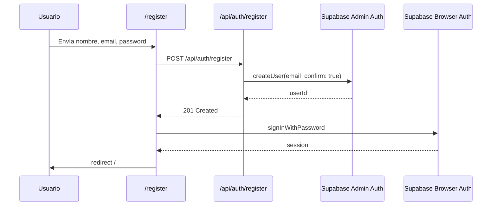

# Supabase Auth Signup SMTP 535

> [!bug] Incidente
> Al crear un usuario desde `/register`, la UI mostraba primero `{}` y luego un mensaje genérico: `Account creation failed. Check your connection and Supabase Auth settings, then try again.`

## Síntomas

- La pantalla de registro no dejaba avanzar.
- El error visible era `{}` o un fallback genérico.
- En Supabase Auth no quedaban usuarios confirmados.
- El endpoint directo `/auth/v1/signup` respondía `500 unexpected_failure`.

## Causa Raíz

Supabase Auth intentaba enviar el email de confirmación usando Custom SMTP y el proveedor SMTP rechazaba las credenciales:

```txt
535 "Authentication credentials invalid"
```

El problema no era React ni Vercel cache. Era una falla operacional en SMTP de Supabase Auth. Como `supabase.auth.signUp()` depende del email de confirmación cuando la confirmación está activa, el registro completo quedaba bloqueado.

## Diagnóstico Que Lo Confirmó

1. Se reprodujo desde UI en producción.
2. Se llamó directamente a Supabase Auth:

```txt
POST /auth/v1/signup
```

Respuesta:

```txt
500 unexpected_failure
Error sending confirmation email
```

3. Se revisaron logs de Supabase Auth con el conector de Supabase.
4. Los logs mostraron:

```txt
path=/signup
status=500
error=535 "Authentication credentials invalid"
auth_event.action=user_confirmation_requested
```

## Solución Aplicada

Se dejó de depender de `supabase.auth.signUp()` en el browser para crear cuentas.

Nuevo flujo:



Archivos relevantes:

- `src/app/api/auth/register/route.ts`
- `src/lib/supabase/admin.ts`
- `src/app/register/RegisterForm.tsx`
- `tests/auth/register-api.test.ts`
- `tests/auth/register-flow.test.tsx`

## Configuración Requerida

Vercel debe tener:

```txt
SUPABASE_SERVICE_ROLE_KEY
```

Ambientes:

- Production
- Preview

> [!danger] Seguridad
> `SUPABASE_SERVICE_ROLE_KEY` nunca debe tener prefijo `NEXT_PUBLIC_`, nunca debe imprimirse en logs y nunca debe commitearse. Si se expone en una conversación, issue, screenshot o archivo, rotarla en Supabase Dashboard.

## Verificación Final Del Incidente

- `SUPABASE_SERVICE_ROLE_KEY` se agregó en Vercel como variable sensible.
- Se redeployó producción.
- `POST /api/auth/register` respondió `201`.
- Se creó un usuario temporal de prueba.
- Se borró el usuario temporal en Supabase.
- El deployment activo fue `dpl_AnRcXXYkURnsxf5XAReBypGz4qZ4`.

## Lecciones

1. Un `{}` en UI puede ser un error serializado mal, no necesariamente un objeto React.
2. Antes de arreglar texto de error, confirmar la falla real en logs del proveedor.
3. Browser `signUp()` acopla el registro a la entrega de email de confirmación.
4. Para workspaces privados, server-side registration con Admin Auth es más controlable.
5. Vercel env vars requieren redeploy para producción.
6. Si Supabase Auth logs dicen `535`, revisar SMTP antes de tocar frontend.

## Runbook Rápido

Si vuelve a fallar el registro:

1. Probar `/api/auth/register` en producción.
2. Revisar Vercel env vars:

```bash
pnpm exec vercel env ls --scope arres1523
```

3. Revisar logs de Vercel para `/api/auth/register`.
4. Revisar Supabase Auth logs.
5. Si aparece `/signup` con `535`, el browser está usando un flujo viejo o el deploy no tomó el nuevo código.
6. Si `/api/auth/register` responde `503`, falta `SUPABASE_SERVICE_ROLE_KEY`.
7. Si responde `400 User already registered`, el usuario ya existe; ir a login o borrar/actualizar usuario desde Supabase Auth.

## Enlaces Relacionados

- [[Errores Conocidos]]
- [[Resend Email Integration]]
- [[API Endpoints]]
- [[Arquitectura]]
- [[Testing]]
