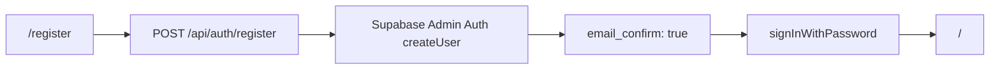

---
tags:
  - metodologia
  - arquitectura
---
# Arquitectura

## Vista General

```
Frontend (Next.js App Router)
  ├── Wizard (6-step client-side state machine)
  │   ├── Step 1: Company + Tax Year
  │   ├── Step 2: Bank Accounts (CRUD)
  │   ├── Step 3: Upload + Column Mapping
  │   ├── Step 4: Review Classifications
  │   ├── Step 5: Reconciliation
  │   └── Step 6: Results + Export
  │
  ├── API Routes (Next.js → PostgreSQL)
  │   ├── /api/auth/register → Crear usuario confirmado con Supabase Admin Auth
  │   ├── /api/upload          → Preview XLSX
  │   ├── /api/import          → Import + Classify
  │   ├── /api/companies       → CRUD
  │   ├── /api/workspaces      → CRUD
  │   ├── /api/accounts        → CRUD
  │   ├── /api/transactions    → Query
  │   ├── /api/classifications → Bulk review
  │   ├── /api/statements      → Query
  │   └── /api/export/*        → Generate files
  │
  └── Librerías UI: Tailwind CSS + React 19

Backend (Next.js API Routes)
  ├── Domain Layer (pure functions)
  │   ├── classification.ts       → Motor de reglas (21 reglas)
  │   ├── categoryOptions.ts      → Taxonomía canónica de 25 categorías
  │   ├── reviewPolicy.ts         → Estados de revisión y documentación
  │   ├── classificationStatus.ts → Helpers de status (getClassificationStatus, getDocumentationStatus)
  │   ├── importXlsx.ts           → Parseo XLSX
  │   ├── importCsv.ts            → Parseo CSV
  │   ├── reconciliation.ts       → Matemática de conciliación
  │   ├── transferMatching.ts     → Matching de transferencias internas (±3 días, ±1¢)
  │   ├── suspense.ts             → Detección de transacciones en suspenso
  │   ├── reporting.ts            → buildFinancialReport (modos, controles, P&L, BS)
  │   ├── cashRollforward.ts      → Reconciliación cash vs transacciones
  │   ├── openingBalances.ts      → Validación A - L = E de saldos de apertura
  │   └── cpaPackage.ts           → Estado del paquete
  │
  ├── Export Layer
  │   ├── workbook.ts             → ExcelJS (P&L, BS, Cash Rollforward, Tx History 12 cols, Report Status, Reconciliation)
  │   └── cpaMemo.ts              → docx (CPA memo)
  │
  └── Database Layer
      └── lib/db.ts               → pg pool + migraciones automáticas (v1-v4)

Infrastructure
  ├── Vercel (hosting Next.js)
  └── Supabase / Neon (PostgreSQL)
```

## Auth y Registro

El registro de usuarios se maneja desde servidor para evitar que la creación de cuentas dependa del email de confirmación de Supabase Auth.



Variables requeridas:

| Variable | Uso | Exposición |
|----------|-----|------------|
| `NEXT_PUBLIC_SUPABASE_URL` | Cliente Supabase browser/server | Pública |
| `NEXT_PUBLIC_SUPABASE_PUBLISHABLE_KEY` | Cliente Supabase browser/server | Pública |
| `SUPABASE_SERVICE_ROLE_KEY` | `src/lib/supabase/admin.ts` para Admin Auth | Secreta, server-only |

> [!warning]
> `SUPABASE_SERVICE_ROLE_KEY` nunca debe tener prefijo `NEXT_PUBLIC_` ni guardarse en git. En Vercel debe existir en Production y Preview.

## Principios Arquitectónicos

1. **Single-Page Wizard** — Toda la funcionalidad en una sola ruta con máquina de estados cliente.
2. **Domain Layer Aislado** — Lógica de negocio en `src/domain/` como funciones puras sin dependencias UI/framework.
3. **API Routes Delgadas** — Controladores que parsean request, llaman al dominio, interactúan con BD y devuelven JSON.
4. **PostgreSQL + Migraciones Embebidas** — Sin ORM. Las migraciones se ejecutan automáticamente al conectar.
5. **Clasificación Determinista** — Sin AI externa. 100% basada en reglas con regex.
6. **Disclaimer Preliminar** — Todos los reportes advierten que son preliminares.
7. **Report Modes** — 3 modos de reporte: `classified_bank_activity`, `preliminary_balance_sheet`, `complete_balance_sheet`.
8. **Transfer Matching Automático** — Detecta transferencias entre cuentas propias y las excluye del P&L/BS.
9. **Cash Rollforward Puro** — Sin ajustes ni "plugs": opening + inflows - outflows = calculated ending vs actual.

## 📁 Estructura de Archivos Clave

| Ruta | Propósito |
|------|-----------|
| `src/app/page.tsx` | Punto de entrada único, renderiza `<Wizard />` |
| `src/app/api/auth/register/route.ts` | Registro server-side con Supabase Admin Auth |
| `src/components/wizard/` | Componentes del wizard (8 archivos) |
| `src/domain/` | Lógica de negocio (14 archivos) |
| `src/exports/` | Generación de archivos (2 archivos) |
| `src/lib/db.ts` | Conexión PostgreSQL + migraciones |
| `src/lib/migrations/` | Migraciones SQL individuales (v1-v4) |
| `src/app/api/` | Rutas API (13 endpoints) |
| `tests/` | Tests unitarios + fixtures |
| `e2e/` | Tests end-to-end Playwright |

## 🔗 Enlaces Relacionados

- [[Flujo de Trabajo]]
- [[Financial Reporting]]
- [[Transfer Matching]]
- [[Suspense]]
- [[Cash Rollforward]]
- [[Opening Balances]]
- [[Category Options]]
- [[Review Policy]]
- [[Base de Datos]]
- [[API Endpoints]]
- [[Decisiones Técnicas]]
- [[Supabase Auth Signup SMTP 535]]
